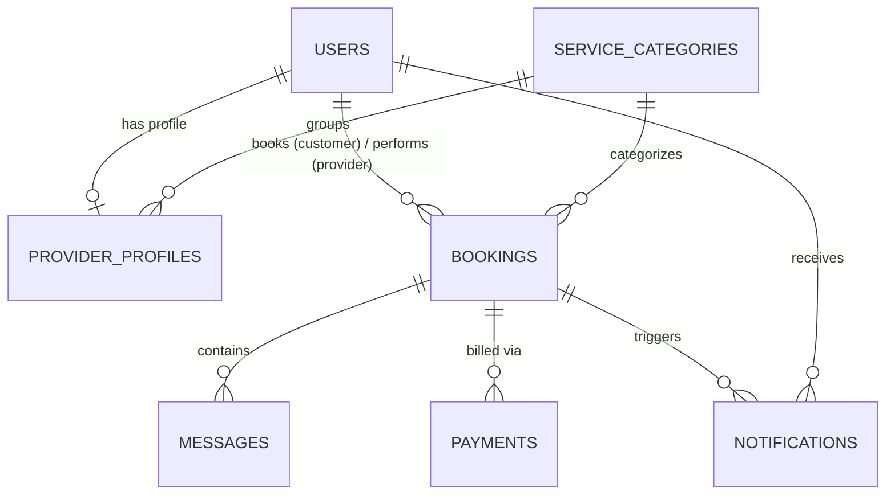

# 🗄️ Database Documentation: PostgreSQL Schema & Design

This document details the database architecture of **Gharelu Sewa**. It is written to help you understand every table, column, relationship, and performance tuning index in our PostgreSQL database.

---

## 🗺️ Entity Relationship Diagram (Conceptual Layout)



---

## 🗃️ Tables and Schemas

### 1. `users` Table
Stores authentication details, basic profile information, and roles for Customers, Providers, and Admins.

| Column | Type | Constraints | Description |
| :--- | :--- | :--- | :--- |
| `id` | `SERIAL` | `PRIMARY KEY` | Unique autoincrementing ID. |
| `name` | `VARCHAR(255)` | `NOT NULL` | User's full name. |
| `email` | `VARCHAR(255)` | `UNIQUE`, `NOT NULL` | Email address (used for logging in). |
| `phone` | `VARCHAR(20)` | | Contact number. |
| `password_hash`| `VARCHAR(255)` | `NOT NULL` | BCrypt encrypted password hash (never stored in plain text). |
| `role` | `VARCHAR(50)` | `CHECK` (customer, provider, admin) | User's role on the platform. |
| `ward` | `VARCHAR(100)` | | Ward/Area name (e.g. Lakeside, Pokhara). |
| `avatar_url` | `TEXT` | | Link to profile avatar. |
| `bio` | `TEXT` | | Profile biography/qualifications description. |
| `is_verified` | `BOOLEAN` | `DEFAULT FALSE` | KYC approval state (Admin verifies this for providers). |
| `is_active` | `BOOLEAN` | `DEFAULT TRUE` | Soft-delete status flag. |
| `created_at` | `TIMESTAMP` | `DEFAULT CURRENT_TIMESTAMP` | Account creation timestamp. |
| `updated_at` | `TIMESTAMP` | `DEFAULT CURRENT_TIMESTAMP` | Last profile update timestamp. |

---

### 2. `service_categories` Table
Lists the different home service categories available on the platform.

| Column | Type | Constraints | Description |
| :--- | :--- | :--- | :--- |
| `id` | `SERIAL` | `PRIMARY KEY` | Unique ID. |
| `name` | `VARCHAR(100)` | `UNIQUE`, `NOT NULL` | Category name (e.g. Plumbing, Electrical). |
| `icon` | `VARCHAR(100)` | | Lucide icon identifier. |
| `description` | `TEXT` | | Brief category description. |
| `created_at` | `TIMESTAMP` | `DEFAULT CURRENT_TIMESTAMP` | Creation timestamp. |

---

### 3. `provider_profiles` Table
Stores provider-specific parameters like rates, categories, availability, and KYC details.

| Column | Type | Constraints | Description |
| :--- | :--- | :--- | :--- |
| `id` | `SERIAL` | `PRIMARY KEY` | Unique ID. |
| `user_id` | `INTEGER` | `UNIQUE`, `NOT NULL`, `REFERENCES users(id) ON DELETE CASCADE` | Link to the provider's `users` row. |
| `category_id` | `INTEGER` | `NOT NULL`, `REFERENCES service_categories(id)` | Associated service category. |
| `hourly_rate` | `DECIMAL(10,2)`| | Booking rate per hour in Rupees. |
| `availability`| `BOOLEAN` | `DEFAULT TRUE` | Toggle switch status (Online/Offline). |
| `rating_avg` | `DECIMAL(3,2)` | `DEFAULT 0` | Average star rating. |
| `total_reviews`| `INTEGER` | `DEFAULT 0` | Total number of rating entries. |
| `citizenship_no`| `VARCHAR(100)`| | Verified citizenship document ID string. |
| `citizenship_image_url`| `TEXT`| | Attached document location. |
| `created_at` | `TIMESTAMP` | `DEFAULT CURRENT_TIMESTAMP` | Registration timestamp. |
| `updated_at` | `TIMESTAMP` | `DEFAULT CURRENT_TIMESTAMP` | Update timestamp. |

---

### 4. `bookings` Table
Tracks booking lifecycles between customers and providers.

| Column | Type | Constraints | Description |
| :--- | :--- | :--- | :--- |
| `id` | `SERIAL` | `PRIMARY KEY` | Unique ID. |
| `customer_id` | `INTEGER` | `NOT NULL`, `REFERENCES users(id)` | ID of the Customer. |
| `provider_id` | `INTEGER` | `NOT NULL`, `REFERENCES users(id)` | ID of the Provider. |
| `category_id` | `INTEGER` | `NOT NULL`, `REFERENCES service_categories(id)` | Booked service category. |
| `booking_date`| `TIMESTAMP` | `NOT NULL` | Scheduled date and time of arrival. |
| `location` | `VARCHAR(255)` | `NOT NULL` | Address/Ward string. |
| `description` | `TEXT` | | Detailed customer problem description. |
| `status` | `VARCHAR(50)` | `CHECK` (pending, accepted, in_progress, completed, cancelled) | Lifecycle status of the job. |
| `is_emergency`| `BOOLEAN` | `DEFAULT FALSE` | Priority broadcast flag. |
| `created_at` | `TIMESTAMP` | `DEFAULT CURRENT_TIMESTAMP` | Creation timestamp. |
| `updated_at` | `TIMESTAMP` | `DEFAULT CURRENT_TIMESTAMP` | Status change timestamp. |

---

### 5. `messages` Table
Maintains real-time and historical chat messages sent in individual bookings.

| Column | Type | Constraints | Description |
| :--- | :--- | :--- | :--- |
| `id` | `SERIAL` | `PRIMARY KEY` | Unique ID. |
| `booking_id` | `INTEGER` | `NOT NULL`, `REFERENCES bookings(id) ON DELETE CASCADE` | Chat room association. |
| `sender_id` | `INTEGER` | `NOT NULL`, `REFERENCES users(id)` | Sender's ID. |
| `content` | `TEXT` | `NOT NULL` | Message text content. |
| `sent_at` | `TIMESTAMP` | `DEFAULT CURRENT_TIMESTAMP` | Timestamp when message was sent. |

---

### 6. `payments` Table
Tracks transaction statuses, eSewa references, and platform commission splits.

| Column | Type | Constraints | Description |
| :--- | :--- | :--- | :--- |
| `id` | `SERIAL` | `PRIMARY KEY` | Unique ID. |
| `booking_id` | `INTEGER` | `NOT NULL`, `REFERENCES bookings(id) ON DELETE CASCADE` | Job being paid. |
| `customer_id` | `INTEGER` | `NOT NULL`, `REFERENCES users(id)` | Payer user ID. |
| `provider_id` | `INTEGER` | `NOT NULL`, `REFERENCES users(id)` | Payee user ID. |
| `amount` | `DECIMAL(10,2)`| `NOT NULL` | Total cost in Rs. (gross). |
| `commission` | `DECIMAL(10,2)`| `NOT NULL` | Platform share (10% fee). |
| `provider_payout`| `DECIMAL(10,2)`| `NOT NULL` | Provider share (90% gross). |
| `payment_method` | `VARCHAR(50)` | `DEFAULT 'esewa'` | Checkout gateway name. |
| `esewa_ref_id` | `VARCHAR(255)`| | Official transaction ref code returned by eSewa. |
| `esewa_oid` | `VARCHAR(255)`| `UNIQUE` | Unique order ID sent to eSewa (Format: `GS-{bookingId}-{timestamp}`). |
| `status` | `VARCHAR(50)` | `CHECK` (pending, completed, failed, refunded) | Status of payment. |
| `paid_at` | `TIMESTAMP` | | Confirmed verification timestamp. |
| `created_at` | `TIMESTAMP` | `DEFAULT CURRENT_TIMESTAMP` | Invoice creation timestamp. |

---

### 7. `notifications` Table
Stores alert banners triggered by bookings, messages, payments, or actions.

| Column | Type | Constraints | Description |
| :--- | :--- | :--- | :--- |
| `id` | `SERIAL` | `PRIMARY KEY` | Unique ID. |
| `user_id` | `INTEGER` | `NOT NULL`, `REFERENCES users(id) ON DELETE CASCADE` | Pushed notification destination. |
| `booking_id` | `INTEGER` | `REFERENCES bookings(id) ON DELETE CASCADE` | Linked booking entity. |
| `message` | `TEXT` | `NOT NULL` | Notification message text. |
| `type` | `VARCHAR(50)` | | Event type flag (e.g. `status_update`, `new_message`). |
| `is_read` | `BOOLEAN` | `DEFAULT FALSE` | Alert read status. |
| `created_at` | `TIMESTAMP` | `DEFAULT CURRENT_TIMESTAMP` | Alert creation timestamp. |

---

## ⚡ Performance Optimization: Indexes

To guarantee sub-second query response times as data scales up, the following indexes are registered:

```sql
CREATE INDEX IF NOT EXISTS idx_users_email ON users(email);                  -- Fast email lookup
CREATE INDEX IF NOT EXISTS idx_users_role ON users(role);                    -- Filtering users by role
CREATE INDEX IF NOT EXISTS idx_provider_profiles_user_id ON provider_profiles(user_id); -- Joining provider profiles
CREATE INDEX IF NOT EXISTS idx_provider_profiles_category_id ON provider_profiles(category_id); -- Finding providers by category
CREATE INDEX IF NOT EXISTS idx_bookings_customer_id ON bookings(customer_id); -- Fetching customer bookings
CREATE INDEX IF NOT EXISTS idx_bookings_provider_id ON bookings(provider_id); -- Fetching provider jobs
CREATE INDEX IF NOT EXISTS idx_bookings_status ON bookings(status);          -- Grouping jobs by status
CREATE INDEX IF NOT EXISTS idx_messages_booking_id ON messages(booking_id);  -- Retrieving chat message history
```
