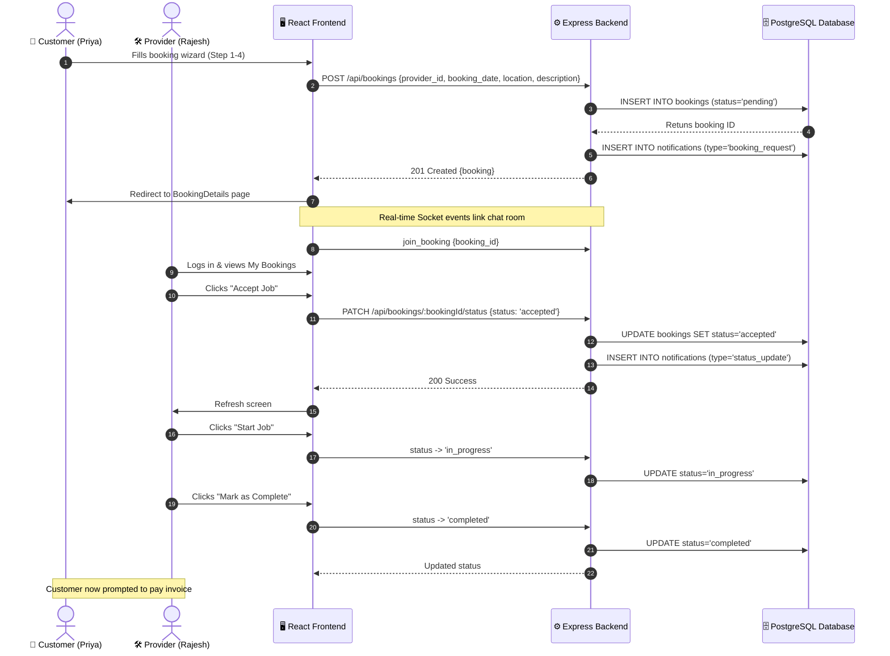
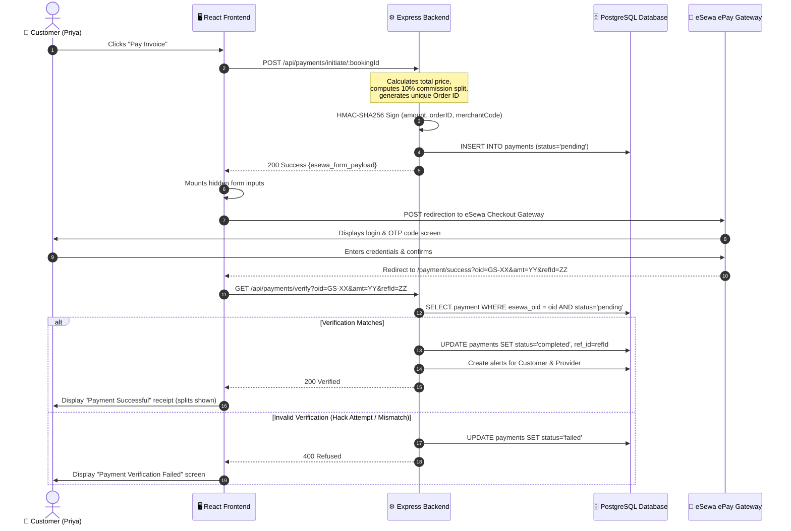
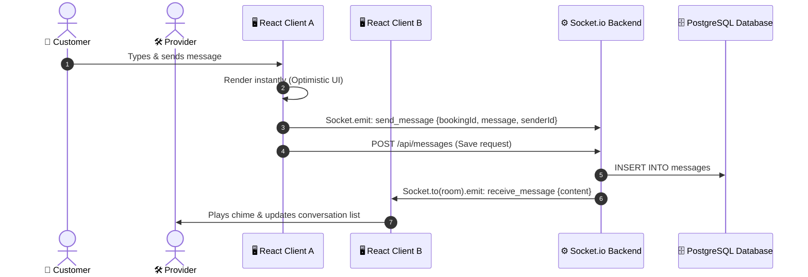

# 🔄 System Interaction & Payment Flows

This document details the architectural interactions and sequence diagrams for the booking process, real-time messaging, and eSewa payments.

---

## 1. End-to-End Booking Lifecycle

The following sequence diagram outlines how a customer schedules a booking, a provider updates the job status, and how the platform handles state updates.

---

## 2. eSewa Payment & Signature Verification Loop

The diagram below details the sequence of transactions required to securely authenticate payments with eSewa v2 ePay API without risk of client-side payload tampering.

---

## 3. Real-time Live Chat Synchronisation

How messages are stored to database and synchronized between client devices simultaneously.

Link this documentation files in the project README.md for future developers.
